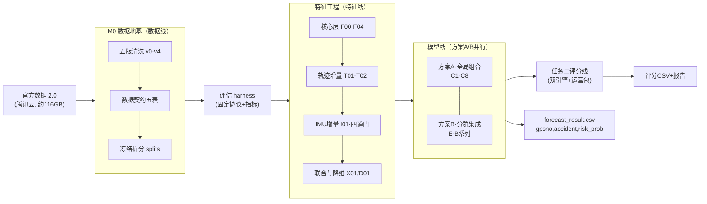

# 2026 清华 IE 亮剑《驾驶安全》全项目执行路线图 v2

> 状态：Proposed（治理基线已运行，算法路线待评审冻结）。快照日期：2026-09-20。
> 本文是项目的**顶层设计与执行路线图**：回答"项目做什么、分几条线、怎么接力、在哪验收"。
> 路线与治理分开：本文所有阶段名称用于组织执行，不表示算法结论已被接受；数值结论的可引用边界见[状态页](DEVELOPMENT_STATUS.md)。

## 1. 项目一句话

基于 500 台货车 60 天四类驾驶行为数据（风险事件 / IMU / 轨迹 / 车辆画像），交付两个任务：**任务一**车辆级事故预测（未来 40 天是否发生事故或未遂事故，AUC 评比）与**任务二**可解释、可运营的司机安全评分体系（评委四维度打分）。提交截止 2026-10-15，决赛 11 月下旬。

## 2. 端到端技术管线

关键原则：**评估 harness 先行**（本地无官方测试标签，一切迭代经同一套折分与指标比较）；**特征按成本递增逐块准入**（事件 → 画像 → 轨迹 → IMU，每块须过准入门槛）；**方案 A/B 并行验证择优**；**任务二与任务一共享特征底座并行推进**。

## 3. 五条工作线与模块登记

工作线清单、模块、入口与实时状态统一登记在 [modules/README.md](modules/README.md)（单一登记源，不在本文重复维护）。

| 工作线 | 职责 | 关键交付 | 主要产物位置 |
| --- | --- | --- | --- |
| 数据线 | 清洗、契约、折分 | 数据契约 v0.1、五版数据 v0–v4、冻结 splits | [interfaces/data_contract.md](interfaces/data_contract.md)、[cleaning/](cleaning/) |
| 特征线 | 特征工程与降维 | F00–F04 / T / I / X / D 实验矩阵、特征字典 | 特征线受控目录 + 实验登记 |
| 模型线 | 基线、组合选型、方案 A/B | 模型契约、组合方案库、A/B 对照结论 | [plans/model-route-proposal.md](plans/model-route-proposal.md)、[interfaces/model_contract.md](interfaces/model_contract.md) |
| 评分线（任务二） | 评分体系与运营包 | 双基线 Q0/Q1、五维子分、运营四件套 | 待登记 |
| 治理线 | 协作、边界、检查 | AGENTS 体系、检查器、CI | [AGENTS.md](../AGENTS.md)、[tools/](../tools/) |

## 4. 阶段门槛（Stage Gates）

| 阶段 | 进入条件 | 完成定义（DoD） | 未过门槛禁止的事 |
| --- | --- | --- | --- |
| S0 数据地基 | 官方数据到位 | 契约五表 + 五版数据 + 冻结折分 + 新旧对照报告 | 在未冻结数据上引用任何模型成绩 |
| S1 评估 harness | S0 完成 | 固定协议（20+40 主回测、冻结五折、AUC+Recall）+ 基线折外预测存档 | 私改折分或指标口径 |
| S2 核心特征与基线 | S1 完成 | F00 冻结、C1 基线与 C3 默认组合复测无回归 | 轨迹/IMU 大规模拼接 |
| S3 增量验证 | S2 完成 | T/I/X/D 逐块消融，每块有支持/暂缓结论 | 无证据的复杂模型投入 |
| S4 终局与提交 | S3 完成或时间到 | A/B 择优、校准与阈值冻结、四类提交物一键生成 | 用最终保留数据反复调参 |

里程碑对齐：交付倒排 M0（管道审计）→ M1（底座基线）→ M2（特征验证）→ M3（评分体系）→ M4（深化文档）→ M5（终检提交 10-12 至 10-15），与特征阶段 A–D 及实验编号 F/T/I/X/D、E-B 的映射见 [plans/model-route-proposal.md](plans/model-route-proposal.md)。

## 5. 接口总览（谁给谁什么）

| 接口 | 上游 → 下游 | 契约位置 |
| --- | --- | --- |
| 数据契约五表 + 双版输出 | 数据线 → 特征线/模型线 | [data_contract.md](interfaces/data_contract.md) |
| 折分与折外预测格式 | 数据线 → 全体 | 同上（splits / oof_predictions） |
| 模型输入输出与评估协议 | 数据线/特征线 → 模型线 → 评分线 | [model_contract.md](interfaces/model_contract.md)（草案） |
| 模型分 model_score | 模型线 → 评分线 | 同上 |
| 官方提交模板 | 模型线/评分线 → 组委会 | forecast_result.csv（gpsno, accident, risk_prob）三列 |

## 6. 新成员 / 新 AI 上手路径（十分钟）

1. 读 [AGENTS.md](../AGENTS.md)（协作规则）→ [DEVELOPMENT_STATUS.md](DEVELOPMENT_STATUS.md)（当前状态与可引用边界）。
2. 读本文第 2、4 节，建立管线与阶段全景；按需深入 [modules/README.md](modules/README.md) 找到具体模块入口。
3. 在 [tasks/](tasks/README.md) 认领或查看任务；动工前读 [COLLABORATION.md](COLLABORATION.md)（分支与 PR）与 [DATA_POLICY.md](DATA_POLICY.md)（数据边界）。
4. 改动结束：跑治理检查与单测 → 交接简报（worklog/）→ PR。
5. 任何数值结论先看 [evidence/](evidence/README.md) 的可引用边界；未核验的写"待复核"。

## 7. 路线图维护规则

- 本文只在**管线结构、阶段门槛、接口拓扑变化**时更新，并更新快照日期；日常状态变化走状态页与模块登记。
- 算法路线的接受/变更须走[决策记录](decisions/README.md)（ADR），本文同步引用最新 ADR 编号。
- 历史版本：v1（2026-09-17 初稿，M0–M4 工程视角）已并入本版结构；如需查阅见 Git 历史。
