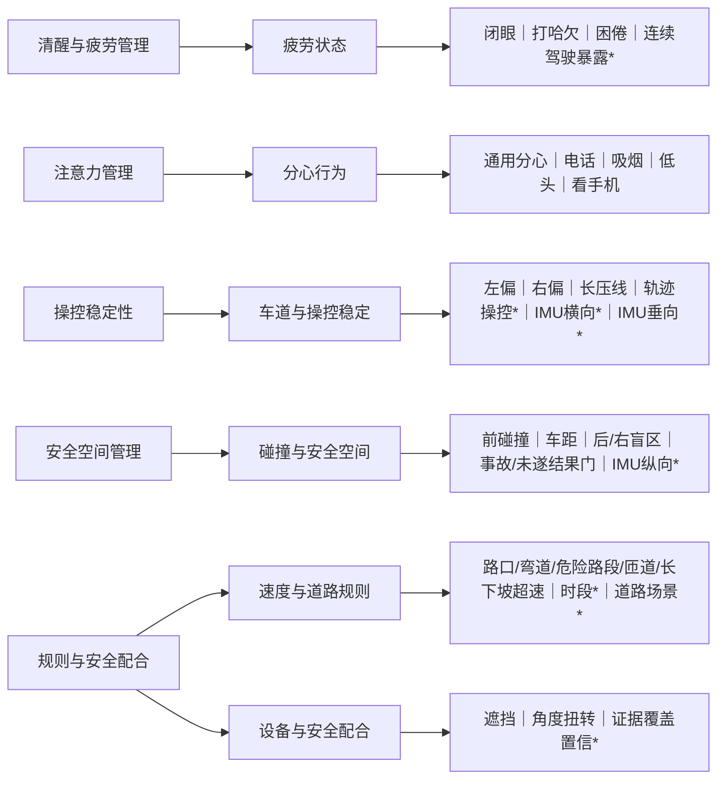

# 任务二三层分类结构（一页版）

版本：T2-R0-v1（待组长裁决）
原则：**一个事件只有一个主要计分归属；次级关联只用于解释风险链，不再次扣分。**

`*` 表示条件或预留小类，质量门、可见性审计和组长裁决通过前保持关闭。

| 内部语义组 | 公开维度 | 已观测编码 | 目录补位项 | 主要作用 |
|---|---|---|---|---|
| 疲劳状态 | 清醒与疲劳管理 | 41001、41002、41029 | 连续驾驶疲劳暴露 | 识别清醒度下降及持续驾驶背景 |
| 分心行为 | 注意力管理 | 41003、41004、41005、41009、41023 | 无 | 识别注意力和手眼资源离开驾驶任务 |
| 车道与操控稳定 | 操控稳定性 | 30002、30003、30017 | 轨迹操控、IMU 横向、IMU 垂向 | 识别横向控制和车道保持异常 |
| 碰撞与安全空间 | 安全空间管理 | 30000、30005、60292、60294、11803、11804 | IMU 纵向 | 识别前向、侧后空间风险；事故和未遂只作结果门 |
| 速度与道路规则 | 规则与安全配合 | 11401、11402、11403、11405、11406 | 时段暴露、道路场景暴露 | 保留不同道路场景的速度语义 |
| 设备与安全配合 | 规则与安全配合 | 41006、41021 | 证据质量与覆盖置信 | 先判断可观测性，再判断持续或人为规避 |

三层目录共 32 个小类：24 个编码对应的小类，加 8 个条件／预留小类。24 个编码包含 22 个行为或警示编码和 2 个结果编码；`11803`、`11804` 不作为普通行为累计扣分。
